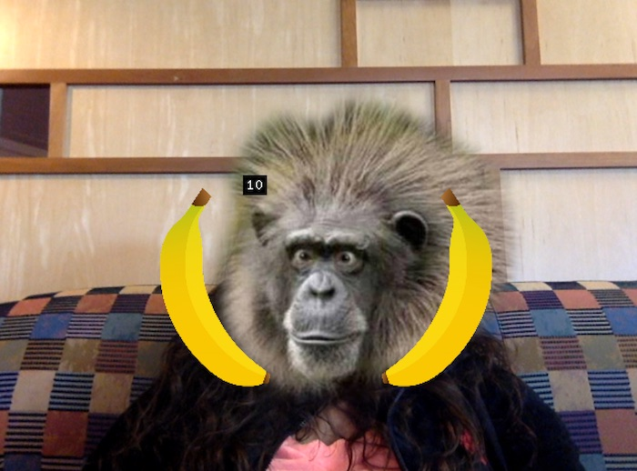

## Working with ofxCv
This is a simple project that explores ofxCv and haarcascade.xml files. It uses the ofxCv example-face-follow as a base, a haarcascade_frontalface_alt2.xml file, and a webcam to track a face and draw an object over a specificed area of that face.

While the program is running, a monkey face and two bananas appear where it tracks a face as shown in the image below:

There is some commented out code throughout the application as I was experimenting with using other haarcascade files that did not end up working quite as well. 

